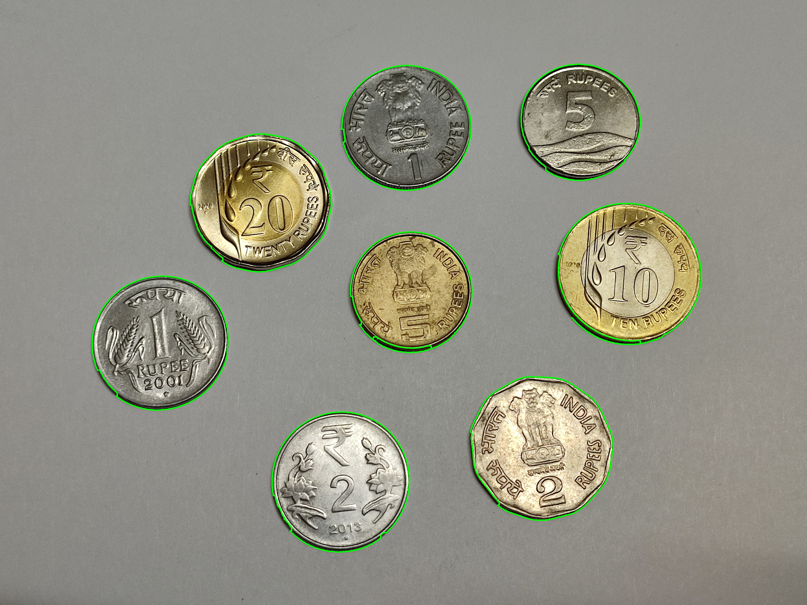
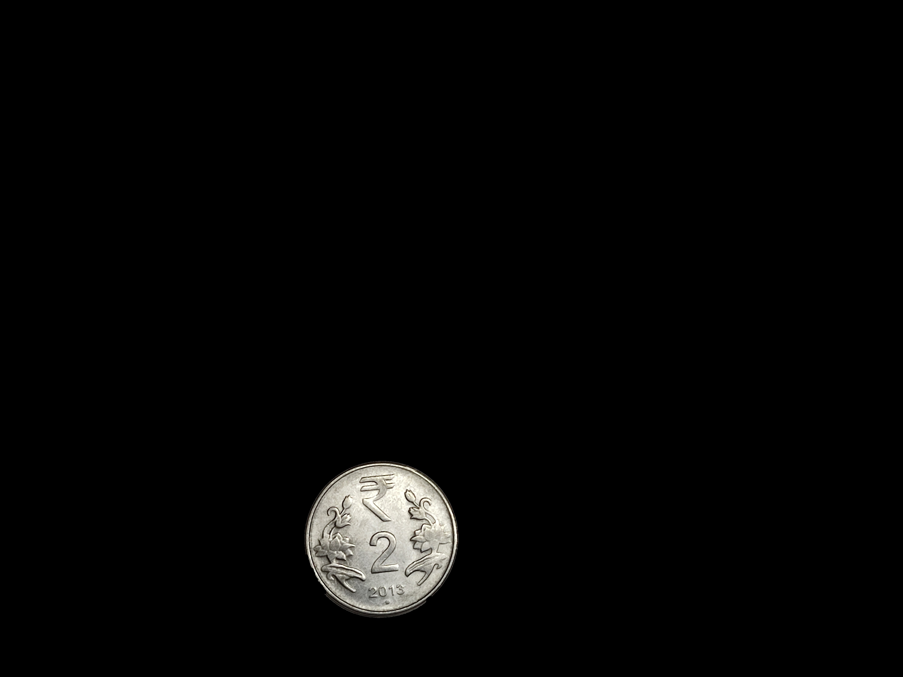

# VR Assignemnt 1 
## environment setup
Install anaconda on your computer
then create a new environment using:
`conda create --name new_environment_name --file requirements.txt`

This file also serves as report, as I have mentioned everything here.

## coin detection

This script detects and segments coins in an image. It performs the following steps:
1. Detects coins in the input image.
2. Segments each detected coin.
3. Counts the total number of coins.
4. Saves the detected and segmented coin images.
5. Saves the total number of coins detected to a file.

### Usage

1. Place the input image in the `./input images/` directory and name it `coins.jpg`.
2. Run the script:
    ```sh
    python a1p1_coins.py
    ```

### Output

The script will generate the following output in the `./output images/coin detection` directory:
1. `detected_coins.jpg`: The image with detected coins outlined.
2. `segmented_coin_X.jpg`: Images of each segmented coin, where `X` is the coin number.
3. `total_coins.txt`: A text file containing the total number of coins detected.

### Methods Chosen

- **Gaussian Blur**: To reduce noise and detail in the image.
- **Canny Edge Detector**: To detect edges in the image.
- **Morphological Transformations**: To close gaps in the edges.
- **Contour Detection**: To find the contours of the coins.

### Results and Observations

- The script successfully detects and segments coins in the input image.
- The total number of coins detected is saved in a text file.
- The segmented coin images are saved in the output directory.

### challaneges and what worked.

- I converted the image to grayscale using `gray = cv2.cvtColor(image, cv2.COLOR_BGR2GRAY)`, convertion to greayscale is recommended. 
- initailly, when I was smoothing the image using gaussian kernal `cv2.GaussianBlur(gray, (m,m), 0)`, when I used kernel sizes of >= 17*17 is was detecting more number of coins and less than 9*9 were giving less number of coins, after few trial and error it was found kernels b/w 11*11 and 15*15 were detecting the exact number of coins.
- Also I had to adjust the parameters of canny for it to work correclty (threshold values 30, 150) otherwise it was joining closer coins. `edges = cv2.Canny(blurred, 30, 150)`


## Panorama Creation
This script creates a panorama by stitching two images together. It performs the following steps:
1. Extracts keypoints and descriptors from the input images.
2. Matches the keypoints between the images.
3. Finds the homography matrix to align the images.
4. Warps one image to align with the other and creates the panorama.

### Usage

1. Place the input images in the `./input images/` directory and name them `Limage1.jpg` and `Rimage1.jpg`.
2. Run the script:
    ```sh
    python a1p2_panorama.py
    ```

### Output

The script will generate the following output in the `./output images/panorama` directory:
1. `stitched_image.jpg`: The final stitched panorama image.
2. `image1_keypoints.jpg`: The first image with keypoints drawn.
3. `image2_keypoints.jpg`: The second image with keypoints drawn.

### Methods Chosen

- **SIFT (Scale-Invariant Feature Transform)**: To detect and describe local features in the images.
- **BFMatcher (Brute-Force Matcher)**: To match the descriptors between the images.
- **Homography**: To find the transformation matrix to align the images.

### Results and Observations

- The script successfully creates a panorama by stitching the input images together.
- The keypoints and matches are visualized and saved in the output directory.

### challaneges and what worked.

- I used the Scale-Invariant Feature Transform (SIFT) algorithm to detect and describe keypoints in an image.
- First, I created a SIFT object using `sift = cv2.SIFT_create()`.
- Then, I converted the image to grayscale using `gray = cv2.cvtColor(image, cv2.COLOR_BGR2GRAY)`, convertion to greayscale is recommended. 
- The keypoints and descriptors were extracted from the grayscale image with `keypoints, descriptors = sift.detectAndCompute(gray, None)`.
- To visualize the detected keypoints, I drew them on the original image using `image_with_keypoints = cv2.drawKeypoints(image, keypoints, None, color=(0, 255, 0))`.
- Finally, I returned the keypoints, descriptors, and the image with keypoints.

## Visual Outputs

### Coin Detection and Segmentation

- `detected_coins.jpg`: 
- `segmented_coin_1.jpg`: 
- `segmented_coin_2.jpg`: 
- ...

### Panorama Creation

- `stitched_image.jpg`: 
- `image1_keypoints.jpg`: 
- `image2_keypoints.jpg`: 
